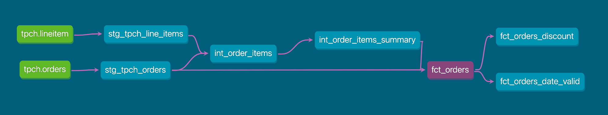

# dbt-snowflake-pipeline
End-to-end ELT pipeline with dbt + Snowflake

# Order Analytics Pipeline — dbt + Snowflake

End-to-end analytics engineering project: from raw data to business-ready fact tables, built with dbt Core and Snowflake.

## Business Context

This pipeline answers key revenue and order management questions:
- What is the gross sales amount per order?
- How much revenue is lost to discounts?
- What is the order volume trend over time?
- Which customers generate the most revenue?

## Architecture

The project follows the **medallion / layered modeling** pattern:

```
Sources (raw)  →  Staging (cleaned)  →  Intermediate (joined)  →  Marts (business-ready)
```



### Layer Breakdown

| Layer | Models | Materialization | Purpose |
|-------|--------|----------------|---------|
| **Sources** | `tpch.orders`, `tpch.lineitem` | — | Raw data from Snowflake Sample Data (TPC-H) |
| **Staging** | `stg_tpch_orders`, `stg_tpch_line_items` | View | Column renaming, type casting, light cleaning |
| **Intermediate** | `int_order_items`, `int_order_items_summary` | Table | Joins and aggregations across staging models |
| **Marts** | `fct_orders` | Table | Final fact table for dashboarding and analysis |

## Data Quality

### Generic Tests (YAML-based)
- `unique` and `not_null` on `fct_orders.order_key`
- `relationships` test ensuring referential integrity with staging
- `accepted_values` on `status_code` (P, O, F)

### Singular Tests (custom SQL)
- `fct_orders_discount` — validates discount amount logic
- `fct_orders_date_valid` — ensures no future-dated or pre-1990 orders

## Custom Macros

- `discounted_amount` — reusable pricing calculation: `(-1 * extended_price * discount_percentage)::decimal(16, scale)`

## Tech Stack

- **Transformation**: dbt Core 1.11.7
- **Data Warehouse**: Snowflake (Enterprise Edition)
- **Packages**: dbt_utils 1.3.3
- **Version Control**: Git
- **Visualization**: Power BI (connected to Snowflake)

## Project Structure

```
data_pipeline/
├── models/
│   ├── staging/
│   │   ├── tpch_sources.yml        # Source definitions + tests
│   │   ├── stg_tpch_orders.sql
│   │   └── stg_tpch_line_items.sql
│   └── marts/
│       ├── generic_tests.yml        # Generic test definitions
│       ├── int_order_items.sql
│       ├── int_order_items_summary.sql
│       └── fct_orders.sql
├── macros/
│   └── pricing.sql                  # discounted_amount macro
├── tests/
│   ├── fct_orders_discount.sql
│   └── fct_orders_date_valid.sql
├── dbt_project.yml
└── packages.yml
```

## How to Run

```bash
# Install dependencies
dbt deps

# Run all models
dbt run

# Run all tests
dbt test

# Generate and serve documentation
dbt docs generate
dbt docs serve
```

## Results

- **5 models** running successfully (2 views + 3 tables)
- **9 tests** passing (7 generic + 2 singular)
- **1.5M rows** processed in the fact table
- Full lineage documentation auto-generated


End-to-end analytics solutions for performance monitoring and decision-making | From business alignment to technical implementation

[LinkedIn](https://www.linkedin.com/in/nmikh/) · [Portfolio](https://mydataportfolio.thesimple.ink/)
